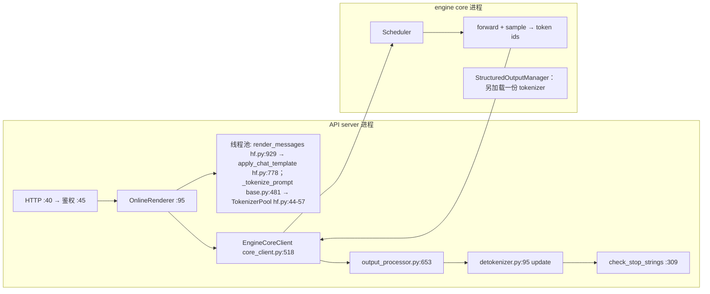

# vLLM 0.26.0 tokenizer 链路：边界与静态分析（线 A）

> **口径冻结（不可混池）**：vLLM `568afb3a13806beb53bb2e6bd518269357b237c0`（0.26.0），
> 本地只读权威副本 `/home/chiro/projects/vllm/HIST_PROJECT/vllm`；下文所有 `路径:行号`
> 均指该副本，写前逐条用 `rg`/`sed` 核对，不凭记忆。本文是**纯静态分析**，不含实验数字
> （成本见 `02`、后端矩阵见 `03`、Rust 前端见 `04`）；推断标 **[推断]**，未证实标 **[未验证]**。

## 0. 结论先行（TL;DR）

1. **链路被劈成两层**：`vllm/tokenizers/`（对象与协议）与 `vllm/renderers/`（渲染 + 编码
   编排）互不继承，Renderer 持有 `TokenizerLike`（`vllm/renderers/registry.py:68`）。
2. **只有三段真实工作量**：入站 encode、出站流式 decode、停止串判定，**全在 API server
   前端进程**；**engine core 不在这条链路上**——除非开 structured output，那时 engine core
   会为语法编译**另加载一份** tokenizer（`vllm/v1/structured_output/__init__.py:79`，
   构造点 `vllm/v1/engine/core.py:137`）。
3. **`tokenizer_pool_size` 在 0.26.0 不存在**（全仓 0 命中）。池大小 = 线程池 worker 数
   `renderer_num_workers`（`vllm/config/model.py:337`）+ 1 份 tokenizer deepcopy
   （`vllm/renderers/hf.py:920-922`）。
4. **历史日志里的 `tokenizer: encode/decode/render_messages` 三个 scope 不是上游代码**，
   是 LiteProfiler 的 vLLM 侧补丁加的（§1.3）；界定清楚后它们**仍可用**，但必须知道
   `tokenizer: decode` 只覆盖"prompt 反解成文本"，**不覆盖生成期解码**。
5. **下一代把整条链路搬进 Rust 进程**：axum → minijinja → `vllm-tokenizer` 编码 →
   ZMQ/MessagePack；流式解码与停止串判定也在 Rust 侧（`text/src/output/decoded.rs:176`）。

## 1. 边界定义

### 1.1 精确起止（当代 Python 前端）

| # | 环节 | 关键位置 | 进程/线程 |
|---|---|---|---|
| 1 | HTTP 入口 | `vllm/entrypoints/openai/chat_completion/api_router.py:40`（`POST /v1/chat/completions`）；`completion/api_router.py:46` | 前端进程，asyncio 事件循环线程 |
| 2 | 鉴权 | `vllm/entrypoints/serve/utils/server_utils.py:45` `AuthenticationMiddleware`，注册于 `vllm/entrypoints/openai/api_server.py:310` | 同上（ASGI middleware） |
| 3 | 路由到 serving handler | `.../chat_completion/api_router.py:53` → `.../chat_completion/serving.py:239` | 事件循环线程 |
| 4 | chat 模板渲染（Jinja） | `vllm/renderers/online_renderer.py:95` → `vllm/renderers/base.py:1070` → `vllm/renderers/hf.py:929` → `:986` `safe_apply_chat_template` → `:778` `tokenizer.apply_chat_template(...)` | **线程池 worker**（`make_async`，`vllm/renderers/base.py:97`） |
| 5 | 编码 encode | `vllm/renderers/base.py:471` `_tokenize_prompt` → `:481` `tokenizer(prompt["prompt"], **kwargs)` | **线程池 worker** |
| 6 | 请求下发（IPC） | `vllm/v1/engine/async_llm.py:280` → `EngineCoreRequest`（`vllm/v1/engine/__init__.py:88`）→ ZMQ（`core_client.py:518` ROUTER / `:525` PULL）+ msgpack（`vllm/v1/serial_utils.py:136`） | 事件循环线程 → socket |
| 7 | engine core | 只消费 `prompt_token_ids`；调度 / forward / sample | engine core 进程 |
| 8 | 流式解码 + 停止串判定 | `vllm/v1/engine/output_processor.py:653` → `vllm/v1/engine/detokenizer.py:95` `update()`；实现 `:167`（Fast）/ `:250`（Slow）；`update()` 内 `:131` 调 `check_stop_strings`（`:309`） | **前端进程，事件循环线程** |

**边界一句话**：从 HTTP body 里的 `messages`/`prompt` 文本 → 变成 `list[int]` 交给 engine
core → 从 engine core 回来的 `list[int]` 变回增量文本并做停止串截断。

### 1.2 明确划出去的东西

| 划出去 | 为什么 | 证据 |
|---|---|---|
| 多模态预处理（图/音/视频 → embedding） | 与 tokenizer 是并列的两条子路径，`_process_multimodal` 与 `_process_tokens` 是兄弟方法 | `vllm/renderers/base.py:728` / `:768` |
| structured output（xgrammar/guidance 语法） | 语法在 **engine core 进程**编译，且**另起一份 tokenizer** | `vllm/v1/structured_output/__init__.py:79` |
| logprobs 解码 / reasoning 解析 / tool 解析 | 在 `OnlineDerenderer` 里对已生成 token 二次加工，**晚于**停止串判定 | `vllm/renderers/online_derenderer.py:76` |
| 前缀缓存 / block hash | 用 token id 做哈希，不调 tokenizer 的编码接口 | 与 `vllm/tokenizers/` 无调用关系 |
| 采样期 `allowed_token_ids` 校验 | 在 `InputProcessor._validate_params`（`vllm/v1/engine/input_processor.py:256`）调起，只读 `len(tokenizer)` | `vllm/sampling_params.py:738` → `:859` |
| prompt embeds 路径 | 跳过 tokenizer，直接给 `prompt_embeds` | `vllm/renderers/base.py:804` |

> **[推断]** 只读属性（`max_chars_per_token`、`all_special_ids` …）每请求会被碰一次，但在
> `get_cached_tokenizer` 的代理类里已缓存成普通字段（`vllm/tokenizers/hf.py:141-195`），
> **不触发 Rust 侧编码**；**未测**：这条路径的耗时。

### 1.3 口径校正：`tokenizer:` 三个 scope 的真实出处

**重要**：本地 0.26.0 全仓检索（覆盖 `vllm/**/*.py` 与 `rust/`），`tokenizer: encode` /
`tokenizer: decode` / `tokenizer: render_messages` / `http: create_completion` /
`input: process_inputs` **一个都不在源码里**（全部 0 命中）。出处是上个项目的 LiteProfiler 补丁
`/home/chiro/projects/vllm/HIST_PROJECT/.research/liteprofiler-patches/liteprofiler-vllm.patch`
（远端对应 `a3-22:~/liteprofiler-vllm.patch`）：

| scope | 补丁位置 | 语义 = 上游哪一段 |
|---|---|---|
| `tokenizer: encode` | patch `:341` | `vllm/renderers/base.py:481` `tokenizer(prompt, **kwargs)` |
| `tokenizer: decode` | patch `:331` / `:351` / `:360` | `vllm/renderers/base.py:163` `_decode`、`:490` / `:495` 两个 `_detokenize_prompt*` |
| `tokenizer: render_messages` | patch `:375` / `:397` | `vllm/renderers/base.py:1049` / `:1085` 两处 `render_messages[_async]` 调用 |

由此得到两条硬口径：**①** 前端 `tokenizer: decode` **不是**生成期解码，只是"prompt
token ids 反解回文本"（`needs_detokenization`，`vllm/renderers/base.py:502`）；生成期逐
token 解码在 `vllm/v1/engine/detokenizer.py`，**完全没有被这三个 scope 覆盖**——
历史上 `decode` 计数为 0 ≠ 生成期不解码。**②** `tokenizer: render_messages` 的 `with` 体
**只包住** `rendered = [...render_messages...]`（patch `:375-380`），其后的
`tokenize_prompts` 在 `with` 之外。

> ⚠️ **本节有一处推论被 C 线实测推翻，已修正（2026-09-25）**：
> 初稿据此推断"`render_messages` 与 `encode` 互不重叠、可以直接相加"，**这是错的**。
> C 线用 `_tokenize_prompt` 打桩计数验证（`docs/02` §1.2）：
> `render_chat(messages)` 下 `_tokenize_prompt` 调用 **0 次**，
> 但**编码确实发生了**——它走的是 `apply_chat_template(tokenize=True)`
> （`vllm/renderers/hf.py:778`），发生在 `render_messages()` **内部**，
> 因此落在 `render_messages` scope 的区间里。
>
> 正确口径：**`render_messages` 含"模板内 encode"，`tokenizer: encode` 只服务文本
> prompt 路径；两者是互补负载，不存在同时走两条的请求形态，所以"相加"没有意义。**
> 这也解释了历史日志里为何二者总有一个计数为 0（历史 run 全是 `/v1/completions` +
> 文本 prompt）。

## 2. 进程模型

### 2.1 进程与线程拓扑（当代）

```
┌─ vllm serve 主进程：只做编排（launch_core_engines / APIServerProcessManager）
├─ ApiServer_i 进程 × --api-server-count（spawn，vllm/v1/utils.py:208-236）
│    AsyncLLM（async_llm.py:132）→ Renderer 持 TokenizerLike（本进程独立一份）
│      ├ InputProcessor（async_llm.py:135）  └ OutputProcessor→IncrementalDetokenizer
│    线程 [T0 事件循环]：HTTP / 路由 / 输出后处理 / 停止串
│    线程 [T1..Tn 线程池 worker，n = renderer_num_workers]：模板渲染 + encode
└─ EngineCore 进程：Scheduler / Worker / 模型执行 / StructuredOutputManager（另加载 tokenizer）
        ▲ ──── ZMQ ROUTER(入) + PULL(出) + msgpack ────┘
```

依据：`vllm/entrypoints/cli/serve.py:257-288`（多 API server 与 `_api_process_count`；
Rust 前端分支在 `vllm/v1/utils.py:328`）。

**engine core 侧没有 tokenizer**（对纯文本模型）：`vllm/v1/worker/gpu_worker.py` 与
`gpu_model_runner.py` 对 `tokenizer` **零命中**。少数模型实现自己拉一份
（如 `vllm/model_executor/models/qwen3_vl_moe.py:220`、`voxtral.py:323`）——
**[推断]** 那是模型实现自用，不在 `execute_model` 每步路径上；**未测**：其实际耗时。

### 2.2 `maybe_make_thread_pool` 与"池大小"

先纠前提：0.26.0 **没有** `tokenizer_pool_size`（全仓 0 命中）。真正决定池大小的是：

| 量 | 值 | 位置 |
|---|---|---|
| 线程池 worker 数 | `renderer_num_workers`，默认 **1** | `vllm/config/model.py:337`；用点 `vllm/renderers/base.py:86-87` |
| tokenizer deepcopy 份数 | `renderer_num_workers + 1` | `vllm/renderers/hf.py:920-922` |
| 用户入口 | `--renderer-num-workers` | `vllm/engine/arg_utils.py:588` |

`maybe_make_thread_pool`（`vllm/tokenizers/hf.py:25`，`copies` 默认 1）四步：
① 只对 `TokenizersBackend` 生效，其它类型原样返回，已池化的再调用幂等（`:37-40`）；
② `og_tokenizer = copy.copy(tokenizer)`（`:42`）——**浅拷贝的"原件"**，deepcopy 的父本；
③ `queue.Queue` 里 `put` 进 `copies` 份 `copy.deepcopy(og_tokenizer)`（`:44-46`）；
④ 造 `TokenizerPool(tokenizer.__class__, ThreadSafeHFTokenizerMixin)` 子类，把
`apply_chat_template / batch_decode / batch_encode / convert_tokens_to_ids /
convert_ids_to_tokens / convert_tokens_to_string / decode / encode / __call__`
九个方法改成"借一份 → 调用 → 归还"（`:59-94`），最后 `tokenizer.__class__ = TokenizerPool`
（`:101`）——**原地换类**，不是包装。池空时**不阻塞**：`get_nowait()` 失败就现场
`copy.deepcopy`（`:51-55`）用完归还，于是**池无上限地长大**；`__reduce__` 保证 pickle
后仍走本函数（`:96-97`，对应 #45433）。

### 2.3 `copy.deepcopy` 的代价（性质，非数字）

复制对象是 `TokenizersBackend`（含 `tokenizers.Tokenizer` 的 Python 包装），**不复制**
tokenizer.json 文本；开销主要在 Python 对象图 + Rust 侧对象重建。触发点两类：启动建池
`copies` 次（`vllm/tokenizers/hf.py:46`）、**运行期池空时**（`:54`）——即并发 >
`renderer_num_workers+1` 的每个超额请求都要付一次 deepcopy，这是本链路唯一"随负载劣化"的
隐藏项。`HfRenderer.__init__` 先 `copy.copy(tokenizer)` 再进池（`vllm/renderers/hf.py:902`），
注释说明是为了"原件永不被池化改写"。**未测**：单次 deepcopy 的 µs 级成本与它在并发拐点上
的占比（属 C 线 E2.5）。

> **[推断]** `copies = renderer_num_workers + 1` 里的 `+1` 是给"不经线程池、直接在事件循环
> 线程同步调用 tokenizer"的路径留额度（如 `warmup()` 的 `render_chat`
> `vllm/renderers/base.py:251`、同步 `_detokenize_prompt` `:488`）；依据是池并发度需求 =
> worker 数 + 主线程 1。**未验证**：无上游注释直接说明。

### 2.4 历史日志的旁证

`/home/chiro/projects/vllm/preparing-input-phase/data/profiles/real-b1/lite.log` 的记录格式是
`name|duration_us|start_us|tid|pid`（补丁 `:445`、`:513`），首两行：

```
tokenizer: encode|458.080|1790195432181946|712698|700907
```

`tokenizer: encode` 的 **tid=712698 ≠ 主线程 700907，pid 相同**：正是"前端线程池 worker 跑
encode"这个模型。全文件计数：`encode` 10 次、`decode` 0 次、`render_messages` 0 次，与
`plan/COORDINATION.md` §5.2 一致（历史负载是直发 token_ids 的 completion）。

## 3. 两代链路对照

### 3.1 两代调用图并排（左：当代 Python 前端；右：下一代 Rust 前端）

```
当代（vllm/renderers + vllm/tokenizers）  │  下一代（rust/src/{chat,text,tokenizer}）
 serving.py:239 → online_renderer.py:95   │   routes.rs:49 (axum) → middleware/auth.rs:22
  └─ base.py:1070 render_chat_async       │    └─ chat/src/lib.rs:175 ChatLlm.chat
      ├─ render_messages_async            │        ├─ chat/src/lib.rs:188 render()
      │   base.py:422 → hf.py:1049        │        │   └─ renderer/hf/template.rs:124
      │    └─ hf.py:986 → :778 [Jinja]    │        │      (minijinja, template.rs:29)
      ├─ tokenize_prompts_async           │        └─ text/src/lib.rs:118 generate
      │   base.py:640 → :97 → :481[encode]│            └─ :132 → :144 encode()
      └─ base.py:961 → TokensInput        │                → EngineCoreClient
 └─ async_llm.py:280 → EngineCoreRequest  │                (ZMQ+msgpack: mod.rs:39/:55)
 ════ 进程边界 ════  engine core: schedule → forward → sample → token ids
 output_processor.py:653                 │  text/src/output/decoded.rs:121
     └─ detokenizer.py:95 update         │    ├─ tokenizer/src/lib.rs:54 → incremental.rs:128
         ├─ decode_next :210(F)/:291(S)  │    └─ decoded.rs:309 stop 判定
         └─ :309 check_stop_strings      │
```

### 3.2 Rust 前端把什么搬进了自己的进程

| 环节 | 当代 | 下一代 | 变化 |
|---|---|---|---|
| HTTP 服务 | FastAPI/uvicorn | axum（`server/src/routes.rs:49`） | 换栈 |
| 鉴权 | `server_utils.py:45` | `middleware/auth.rs:22` | 换栈，语义相同 |
| chat 模板 | Jinja2（transformers 内） | **minijinja**（`renderer/hf/template.rs:29`） | **换引擎**，同一份 Jinja 模板字符串 |
| tokenizer | `tokenizers`(Rust) + Python 包装 | `tokenizers`(Rust) 直用，fastokens 一等后端 | 去掉 Python 层 |
| 增量解码 | FastIncrementalDetokenizer（Python 调 tokenizers） | 纯 Rust `DecodeStream`（`incremental.rs:30`） | 去掉 Python 层 |
| 停止串 | `check_stop_strings`（Python） | `matches_stop_string`（`decoded.rs:309`） | 去掉 Python 层 |
| structured output（语法） | engine core 侧 | engine core 侧（未搬） | — |
| 多模态 | 前端 MM 处理器 | Rust `multimodal`（仍依赖外部 crate） | 部分搬 |

**没搬的**：engine core（调度、前向、采样、grammar）原封留在 Python。`rust/README.md:3`
原话："rebuild the northbound serving layer in Rust while still talking to the core Python
vLLM engine process(es) via ZMQ over the existing engine boundary"。

### 3.3 南北向边界在哪

| 方向 | 载体 | 当代 | 下一代 |
|---|---|---|---|
| 北向（客户端↔前端） | HTTP/JSON | FastAPI | axum；**共享监听 fd**：Python `RustFrontendProcessManager` 传 `--listen-fd`（`vllm/v1/utils.py:353`） |
| 南向（前端↔engine core） | **ZMQ（ROUTER 入 / PULL 出）+ MessagePack** | `vllm/v1/engine/core_client.py:518-527`、`vllm/v1/serial_utils.py:136` | Rust 重实现同一协议：`zeromq` + `rmp-serde`（`rust/Cargo.toml` workspace 依赖），入口 `rust/src/engine-core-client/src/protocol/mod.rs:39` / `:55` |

**边界上的语义关键点**：南向 DTO `EngineCoreSamplingParams` **没有 `stop` 字符串字段**，注释
明写"user-facing request semantics such as `stop` strings ... are intentionally handled by
higher layers before values reach this DTO"（`engine-core-client/src/protocol/sampling.rs:51-56`）
⇒ **停止串判定天然属于前端**，两代相同；差别只是当代在 asyncio 线程、下一代在 tokio 任务。

## 4. `TokenizerLike` 协议全文（`vllm/tokenizers/protocol.py`，共 130 行）

`Protocol` 类定义在 `:13`。逐成员列出并标注调用频率：

| 行号 | 成员 | 签名要点 | 调用频率 |
|---|---|---|---|
| `:15` | `from_pretrained`（classmethod） | `(path_or_repo_id, *args, trust_remote_code=False, revision=None, download_dir=None, **kwargs) -> TokenizerLike` | **启动一次**（`registry.py:236`；`lru_cache` 在 `registry.py:250`） |
| `:26` | `num_special_tokens_to_add` | `() -> int` | 启动（MM 处理器构造）**[推断]** |
| `:30` | `all_special_tokens`（property） | `-> list[str]` | **启动一次**，结果被缓存（`hf.py:115-116` → `:147`） |
| `:34` | `all_special_ids`（property） | `-> list[int]` | 同上（`hf.py:115` → `:143`）；采样参数校验也读 |
| `:38` | `bos_token_id`（property） | `-> int` | 启动 + 每请求零星（`base.py:302`） |
| `:42` | `eos_token_id`（property） | `-> int` | 同上（`base.py:311`） |
| `:46` | `pad_token_id`（property） | `-> int` | 启动 / 池化任务 |
| `:50` | `is_fast`（property） | `-> bool` | **每请求**（`base.py:430`、`hf.py:924`、`detokenizer_utils.py:241`）——已缓存（`hf.py:159`） |
| `:54` | `vocab_size`（property） | `-> int` | 启动；`__len__` 也走它 |
| `:58` | `max_token_id`（property） | `-> int` | 启动（logits 上界）——缓存（`hf.py:151`） |
| `:62` | `max_chars_per_token`（property） | `-> int` | **每请求**（`params.py:334`）——缓存（`hf.py:155`） |
| `:66` | `truncation_side`（property） | `-> str` | 启动 |
| `:69` | `__hash__` | `hash(id(self))` | 每次 `lru_cache` 命中 |
| `:72` | `__len__` | `return self.vocab_size` | 启动；Slow 解码边界检查 `detokenizer_utils.py:219` 也用 |
| `:75` | `__call__` | `(text, text_pair=None, add_special_tokens=True, truncation=False, max_length=None) -> BatchEncoding` | **热路径：每请求一次**（`base.py:481`） |
| `:85` | `get_vocab` | `-> dict[str, int]` | **启动一次**，缓存（`hf.py:117` → `:183`） |
| `:88` | `get_added_vocab` | `-> dict[str, int]` | **每 token**（Slow 路径 `detokenizer_utils.py:34`）——**热路径** |
| `:91` | `encode` | `(text, truncation=None, max_length=None, add_special_tokens=True) -> list[int]` | 非流式路径（`/tokenize`、bad words）；主链路走 `__call__` **[推断]** |
| `:100` | `apply_chat_template` | `(messages, tools=None, **kwargs) -> str \| list[int]` | **热路径：每 chat 请求一次**（`hf.py:750` / `:778`） |
| `:108`/`:112`/`:114` | `convert_tokens_to_ids`（2 个 overload + 实现） | `str->int` / `list[str]->list[int]` | 启动（特殊 token 解析）**[推断]** |
| `:117` | `convert_tokens_to_string` | `(tokens: list[str]) -> str` | **热路径：每个新 token 一次**（Slow：`detokenizer_utils.py:242/245`） |
| `:120` | `decode` | `(ids, skip_special_tokens=False) -> str` | 每请求（prompt 反解 `base.py:490`）+ derenderer |
| `:125` | `convert_ids_to_tokens` | `(ids, skip_special_tokens=False) -> list[str]` | **热路径：每个新 token 一次**（Slow：`detokenizer_utils.py:221`） |

**读法**：真正的每请求热路径只有 5 个入口——`__call__`、`apply_chat_template`、`decode`，
以及 Slow 解码特有的 `convert_ids_to_tokens` / `convert_tokens_to_string` /
`get_added_vocab`；其余全是启动期或只读缓存属性。这正是 `get_cached_tokenizer`
（`vllm/tokenizers/hf.py:107`）存在的理由。

## 5. 关键数据结构与 IO 语义

### 5.1 `TokenizerLike.__call__` 的返回

返回 `transformers.BatchEncoding`（`vllm/tokenizers/protocol.py:82`），vLLM 只读两个键：

| 键 | 何时使用 | 位置 |
|---|---|---|
| `input_ids` | 总是 | `vllm/renderers/base.py:483` |
| `offset_mapping` | 仅当 `return_token_offsets=True` 且 `is_fast` 且无 MM 数据 | 门控 `_wants_offsets` `:438`，写入 `:477-485` |

`_can_produce_offsets` 默认 `False`，只有 `HfRenderer` 覆写成 `self.tokenizer.is_fast`
（`base.py:430`、`hf.py:924-927`）；偏移最终落到 `TokensPrompt.prompt_token_offsets`
（`base.py:451-467`）。

### 5.2 `TokensPrompt` 与它的引擎侧影子

`TokensPrompt` 是 `TypedDict`（`vllm/inputs/llm.py:106`）：

| 字段 | 类型 | 说明 |
|---|---|---|
| `prompt_token_ids` | `list[int]`（必填） | 编码结果，或用户直接给的 token id |
| `prompt` | `NotRequired[str]` | 原始文本；`needs_detokenization` 时被反填（`base.py:490`） |
| `token_type_ids` | `NotRequired[list[int]]` | cross-encoder 用 |
| `prompt_token_offsets` | `NotRequired[list[tuple[int,int]] \| None]` | 见 5.1 |
| 继承 `_PromptOptions`（`llm.py:64-96`）：`multi_modal_data` / `mm_processor_kwargs` / `multi_modal_uuids` / `cache_salt` | | MM 与前缀缓存 |

它**不是**送进 engine 的结构：`process_for_engine`（`base.py:944`）先转成 `TokensInput`
（`vllm/inputs/engine.py:29`：`type="token"` / `prompt_token_ids` / `prompt` /
`prompt_token_offsets` / `assistant_tokens_mask`）并附 `arrival_time`；再往下才是
`EngineCoreRequest`（`vllm/v1/engine/__init__.py:88`，`msgspec.Struct` 且
`array_like=True, omit_defaults=True`，序列化见 `vllm/v1/serial_utils.py:136`）。
**语义泄漏点**：`EngineCoreRequest` 有 `prompt_token_ids` 但**没有 offset 字段**；
**[推断]** 偏移量只服务前端（如 `/render` 的 token-offset 响应），不参与生成。

### 5.3 `IncrementalDetokenizer` 的两种实现与分派

分派点 `IncrementalDetokenizer.from_new_request`（`vllm/v1/engine/detokenizer.py:49`）：

```python
# tokenizer is None → :56 返回不解码的 IncrementalDetokenizer()
USE_FAST_DETOKENIZER = version.parse(tokenizers.__version__) >= version.parse("0.22.0")  # :24
if USE_FAST_DETOKENIZER and isinstance(tokenizer, TokenizersBackend):  # :60 → Fast
return SlowIncrementalDetokenizer(tokenizer, request)                  # :65 兜底
```

即**两个条件同时成立**才走快路：`tokenizers >= 0.22.0`（装载时判定一次的静态常量）**且**
tokenizer 是 transformers v5 的 `TokenizersBackend`；容器内是 0.22.2（`COORDINATION.md` §3），
故 Qwen3 这类纯 HF 模型默认走 Fast。

**FastIncrementalDetokenizer（`:167`）**：用 `tokenizers.decoders.DecodeStream` 把 prompt
当"原生 prefill"喂进去。`self.tokenizer = tokenizer._tokenizer` 拿 Rust 侧对象（`:177`），
`DecodeStream(ids=request.prompt_token_ids, ...)`（`:183-186`）——
**刻意从模块属性查 `DecodeStream`** 而非 `from ... import`，以兼容 fastokens 对它的重绑定
（注释 `:180-182`）；`decode_next` 就是 `stream.step(tokenizer, next_token_id)`（`:225`）。
异常兜底两条：`OverflowError/TypeError` 记日志（#21951）、`"Invalid prefix encountered"`
时**重建 DecodeStream**（#17448）（`:223-247`）。特殊 token 的补空格逻辑把
`added_token_ids` 惰性缓存**到 tokenizer 对象上**（`:188-208`、`:213-221`）——
注意这是对共享对象的写，池化后可命中不同副本。

**SlowIncrementalDetokenizer（`:250`）**：纯 Python 前缀偏移算法。初始化时
`convert_prompt_ids_to_tokens(...)` 得 `(tokens, prefix_offset, read_offset)`（`:263-270`，
实现 `detokenizer_utils.py:119`）；prompt embeds 无法解码时用 `[""] * prompt_len` 占位
（`:272-275`）。`decode_next` 调 `detokenize_incrementally(...)` 并回写三份状态（`:291-306`，
实现 `detokenizer_utils.py:176`），偏移起点是 `INITIAL_INCREMENTAL_DETOKENIZATION_OFFSET = 5`
（`detokenizer_utils.py:59`）；`output_token_ids` 需减去 `prompt_len`（`:282-289`）。

**两者共用的外层** `BaseIncrementalDetokenizer`（`:68`）负责：停止串缓冲
`stop_buffer_length = max(len(s) for s in stop) - 1`（`:87`）——与 Rust 侧
`min_bytes_to_buffer` 是**同一概念**（`rust/src/text/src/output/decoded.rs:127-137`）；
`update()`（`:95`）跳过触发停止的最后一个 token（`:107-113`）→ 逐 token `decode_next`
→ 累积 `output_text` → `check_stop_strings`（`:131`）→ 命中则截断（`:140`），
其中 `min_tokens` 会把 `stop_check_offset` 往前推（`:120-122`）；
`get_next_output_text(finished, delta)`（`:148`）按缓冲长度扣住尾部；
`check_stop_strings`（`:309`）用 `find(stop_str, 1 - new_char_count - stop_string_len)`
避免重扫已搜过的文本（`:324-331`）。

> **两代差异（注意）**：Slow = 每 token 两段子串 `convert_*`；Fast = Rust 侧 `step()` 增量；
> Rust 前端是**第三种**：每 token 做一次全量 `tokenizer.decode(ids)` 再取增量
> （`rust/src/tokenizer/src/incremental.rs:135-146`），并用 `SAFE_SUFFIX_MIN/MAX = 4/6`
> 的短后缀播种避免重复解整段 prompt（`:67-124`）。三者算法不同，
> **跨实现的 decode 数字不可直接比**。

## 6. 调用图（Mermaid：进程 / 线程 / 资源归属）



读法：`HTTP → 鉴权 → OnlineRenderer → [线程池：render_messages(Jinja) + encode]
→ EngineCoreClient —ZMQ/msgpack→ engine core → OutputProcessor →
IncrementalDetokenizer.update[decode_next, check_stop_strings]`；Rust 前端并排图见 §3.1。

## 7. 不确定点汇总

| # | 事项 | 状态 |
|---|---|---|
| 1 | 三个 `tokenizer:` scope 的**插桩开销** | **未测**；`VLLM_CUSTOM_SCOPES_FOR_PROFILING` 关闭时是 `nullcontext`（`vllm/v1/utils.py:755-759`），成本须实测 |
| 2 | `copies = renderer_num_workers + 1` 中 `+1` 的意图；单次 `copy.deepcopy` 耗时 | 前者 **[推断]**（§2.3）；后者 **未测**（属 C 线 E2.5） |
| 3 | `tokenizer_pool_size` | **该名字不存在**；应理解为"池大小 = `renderer_num_workers + 1`" |
| 4 | Rust 前端是否真被启用过 | **未验证**；`VLLM_USE_RUST_FRONTEND` 默认 `0`（`vllm/envs.py:155`、`:1339`），本文只做源码级分析 |
| 5 | `Backend::FastokensByteLevel` vs `Fastokens` 的性能差；历史 lite.log 仅 10 条 encode 样本 | 前者见 `docs/03-backend-matrix.md`；后者统计意义有限，**不得**据此下分布结论 |
